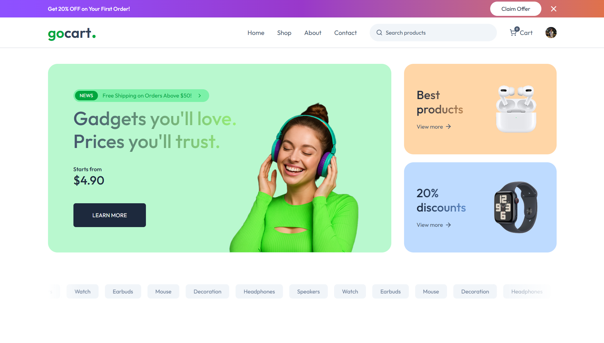
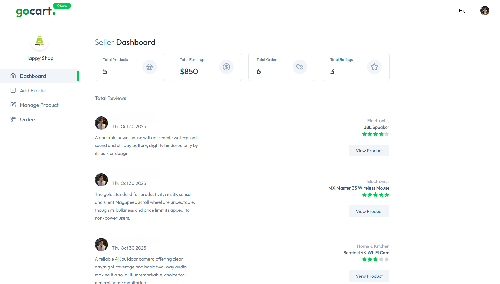

<div align="center">

# � GoCart

### Modern Multi-Vendor E-Commerce Platform

_Empowering organizations with seamless shopping, selling, and marketplace solutions._

[](https://go-cart-theta.vercel.app)
[](https://nextjs.org/)
[](https://nextjs.org/)
[](https://reactjs.org/)
[](https://reactjs.org/)
[](https://tailwindcss.com/)
[](https://tailwindcss.com/)
[](https://clerk.com/)
[](https://clerk.com/)

[](#)
[](#)
[](#)
[](#)
[](#)
[](#)
[](#)
[](#)
[](#)
[](#)
[](#)
[](#)


[Live Demo](https://go-cart-theta.vercel.app)

</div>

---

## 📋 Overview

**GoCart** is a full-featured, open-source multi-vendor e-commerce platform that enables multiple sellers to manage their own stores on a unified marketplace. Built with modern web technologies, it offers a seamless shopping experience for customers, comprehensive tools for vendors, and powerful admin controls for platform management.

---

## 📸 Screenshots

<table>
  <tr>
    <td align="center"><b>Homepage</b></td>
    <td align="center"><b>Dashboard</b></td>
  </tr>
  <tr>
    <td></td>
    <td></td>
  </tr>
</table>

---

## ✨ Key Features

### 🛍️ For Customers

- 🔍 Browse products from multiple vendors
- 🛒 Smart shopping cart with real-time updates
- 💳 Secure payments via Stripe & Cash on Delivery
- 📦 Order tracking and history
- ⭐ Product ratings and reviews
- 🎟️ Coupon code support
- 📍 Multiple address management

### 🏪 For Vendors

- 📊 Comprehensive store dashboard
- 📦 Product management (CRUD operations)
- 🤖 AI-powered product listing (OpenAI integration)
- 📈 Sales analytics and order tracking
- 🖼️ Image upload with ImageKit integration
- 📋 Inventory management

### 👨‍💼 For Admins

- 🎛️ Full platform control
- ✅ Store approval system
- 🎫 Coupon management
- 📊 Analytics and reporting
- 🔧 Store management and monitoring

---

## 🛠️ Tech Stack

### Core Technologies

- ⚡ **Next.js 15.5** - React framework with App Router
- ⚛️ **React 19** - UI library
- 🎨 **Tailwind CSS 4** - Utility-first CSS framework
- 🗄️ **PostgreSQL** - Database (via Neon serverless)
- 🔐 **Clerk** - Authentication & user management

### State & Data

- 🔄 **Redux Toolkit** - State management
- 🗃️ **Prisma** - ORM for database operations

### Payment & Media

- 💰 **Stripe** - Payment processing
- 🖼️ **ImageKit** - Image optimization & CDN
- 🤖 **OpenAI** - AI-powered product descriptions

### Additional Tools

- 📮 **Inngest** - Background job processing
- 📊 **Recharts** - Data visualization
- 🔥 **React Hot Toast** - Notifications
- 🎨 **Lucide React** - Icon library

---

## 📦 Dependencies

<details>
<summary>Click to expand full dependency list</summary>

### Production Dependencies

```json
{
  "@clerk/nextjs": "^6.33.7",
  "@imagekit/nodejs": "^7.1.1",
  "@neondatabase/serverless": "^1.0.2",
  "@prisma/adapter-neon": "^6.17.1",
  "@prisma/client": "^6.17.1",
  "@reduxjs/toolkit": "^2.8.2",
  "axios": "^1.12.2",
  "date-fns": "^4.1.0",
  "imagekit": "^6.0.0",
  "inngest": "^3.44.3",
  "lucide-react": "^0.525.0",
  "next": "^15.5.6",
  "openai": "^6.7.0",
  "react": "^19.0.0",
  "react-dom": "^19.0.0",
  "react-hot-toast": "^2.5.2",
  "react-redux": "^9.2.0",
  "recharts": "^3.1.2",
  "stripe": "^19.2.0",
  "ws": "^8.18.3"
}
```

### Development Dependencies

```json
{
  "@tailwindcss/postcss": "^4",
  "@types/ws": "^8.18.1",
  "prisma": "^6.17.1",
  "tailwindcss": "^4"
}
```

</details>

---

## 🚀 Getting Started

### Prerequisites

- Node.js 18+ installed
- PostgreSQL database (or Neon account)
- Clerk account for authentication
- Stripe account for payments
- ImageKit account for image hosting
- OpenAI API key (optional, for AI features)

### Installation

1. **Clone the repository**

   ```bash
   git clone https://github.com/Purab2001/GoCart.git
   cd GoCart
   ```

2. **Install dependencies**

   ```bash
   npm install
   ```

3. **Set up environment variables**

   Create a `.env.local` file in the root directory:

   ```env
   # Database
   DATABASE_URL="your_postgresql_url"

   # Clerk Authentication
   NEXT_PUBLIC_CLERK_PUBLISHABLE_KEY="your_clerk_publishable_key"
   CLERK_SECRET_KEY="your_clerk_secret_key"
   NEXT_PUBLIC_CLERK_SIGN_IN_URL=/sign-in
   NEXT_PUBLIC_CLERK_SIGN_UP_URL=/sign-up

   # Stripe
   NEXT_PUBLIC_STRIPE_PUBLISHABLE_KEY="your_stripe_publishable_key"
   STRIPE_SECRET_KEY="your_stripe_secret_key"
   STRIPE_WEBHOOK_SECRET="your_stripe_webhook_secret"

   # ImageKit
   IMAGEKIT_PUBLIC_KEY="your_imagekit_public_key"
   IMAGEKIT_PRIVATE_KEY="your_imagekit_private_key"
   IMAGEKIT_URL_ENDPOINT="your_imagekit_url"

   # OpenAI (Optional)
   OPENAI_API_KEY="your_openai_api_key"
   OPENAI_MODEL="gpt-4o"

   # Other
   NEXT_PUBLIC_CURRENCY_SYMBOL="$"
   ```

4. **Set up the database**

   ```bash
   npx prisma generate
   npx prisma db push
   ```

5. **Run the development server**

   ```bash
   npm run dev
   ```

6. **Open your browser**

   Navigate to [http://localhost:3000](http://localhost:3000)

### Building for Production

```bash
npm run build
npm start
```

---

<div align="center">

### Made with ❤️ by [Purab](https://github.com/Purab2001)

⭐ Star this repo if you find it helpful!

</div>
